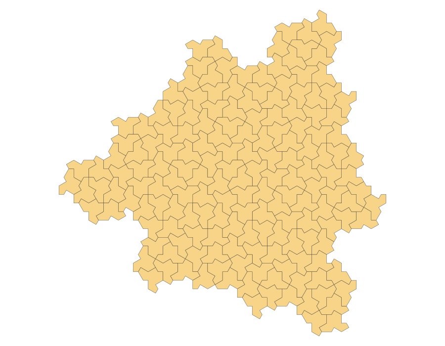
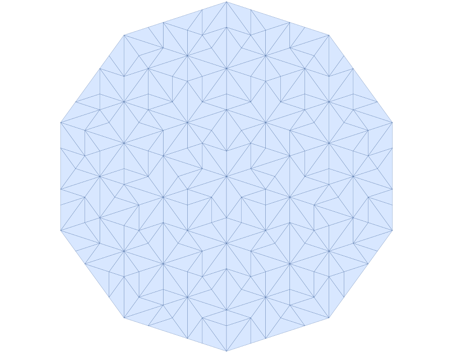

# hat-amp

Python tools for aperiodic tilings and percolation experiments.

`hat-amp` generates exact hat monotile coordinates from Craig Kaplan's
[hatviz](https://github.com/isohedral/hatviz) substitution system, plus Penrose
Robinson-triangle patches. It also provides vertex and tile-dual graph builders,
square-window cropping, site/bond percolation helpers, `.npz` result persistence,
and SVG/PNG rendering.

<!-- markdownlint-disable MD033 -->
<p align="center">
  
  
</p>
<!-- markdownlint-enable MD033 -->

---

## Installation

```bash
uv add hat-amp
```

Graph and percolation helpers need SciPy:

```bash
uv add "hat-amp[graph]"
```

PNG export needs CairoSVG:

```bash
uv add "hat-amp[viz]"
```

Requires Python >= 3.13.

## Quick start

```python
from hat_amp.tiling import generate_tiling

hats = generate_tiling(level=3)   # list of 1156 arrays, each shape (13, 2)
```

For the larger finite-window patch used by percolation workflows:

```python
from hat_amp.tiling import generate_patch_tiling

patch_hats = generate_patch_tiling(level=3)  # 3603 hat polygons
```

Full API documentation: [`docs/API.md`](docs/API.md).

## Example: Graph Crop And Site Percolation

```python
from hat_amp.graph import build_vertex_graph, crop_square
from hat_amp.percolation import BoundarySets, Criterion, run_site_trials
from hat_amp.tiling import generate_patch_tiling

polygons = generate_patch_tiling(level=3)
graph = build_vertex_graph(polygons)
cropped = crop_square(graph, L=100.0)
boundaries = BoundarySets.from_cropped_graph(cropped)

thresholds = run_site_trials(
    cropped,
    boundaries,
    trials=200,
    seed=123,
    criterion=Criterion.INTERSECTION,
)

print(thresholds.mean())
```

## Example: Render Hat And Penrose SVGs

```python
from hat_amp.penrose import generate_penrose_tiling
from hat_amp.tiling import generate_tiling
from hat_amp.viz import render_svg, save_svg

hat_svg = render_svg(generate_tiling(level=2), stroke="#222222", fill="none")
save_svg(hat_svg, "hat_level_2.svg")

penrose = generate_penrose_tiling(divisions=4, scale=200.0)
penrose_svg = render_svg(penrose.polygons(), stroke="#3366aa", fill="none")
save_svg(penrose_svg, "penrose_level_4.svg")
```

## Features

- Hat `H/T/P/F` metatile substitution and full patch generation.
- Penrose Robinson-triangle subdivision.
- Vertex graphs and tile-dual graphs from polygon tilings.
- Square-frame cropping with boundary node sets.
- Site and bond percolation with intersection/union crossing criteria.
- Finite-size weighted least-squares extrapolation for `p_c`.
- `.npz` result persistence with pydantic metadata.
- SVG output and optional PNG export.

---

## Reference

- **Kaplan's hatviz** — [`hat.js`](https://raw.githubusercontent.com/isohedral/hatviz/main/hat.js) · [`geometry.js`](https://raw.githubusercontent.com/isohedral/hatviz/main/geometry.js)
  - `geometry.js`: affine transforms as 6-element arrays `[a,b,tx,c,d,ty]`
  - `hat.js`: metatile definitions, 28 substitution rules, recursive inflation
- **Aperiodic-Monotile-Percolation** —
  [github.com/aaryashBharadwaj/Aperiodic-Monotile-Percolation](https://github.com/aaryashBharadwaj/Aperiodic-Monotile-Percolation)
  for reference percolation workflows and numerical cross-validation in tests.
- Smith, Myers, Kaplan, Goodman-Strauss. *An aperiodic monotile.* Combinatorial
  Theory 4 (2024). arXiv:2303.10798

---

## Acknowledgments

Tiling generation ported from Craig Kaplan's
[hatviz](https://github.com/isohedral/hatviz) (BSD-3-Clause).
