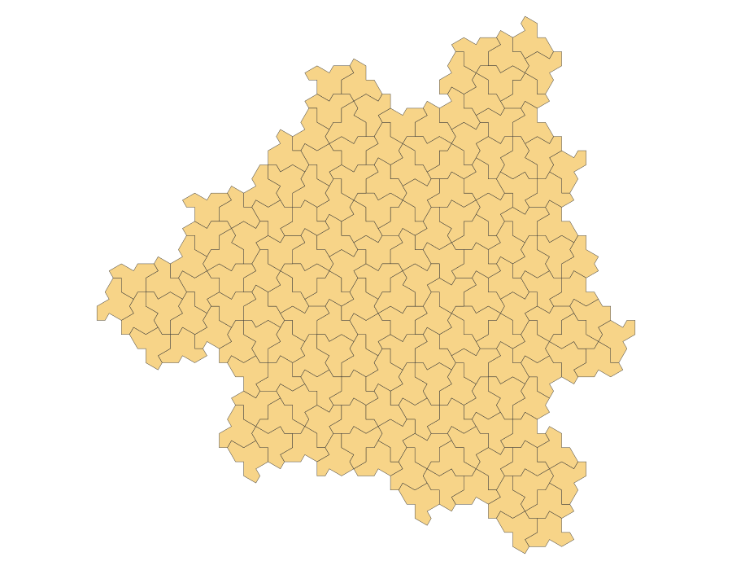
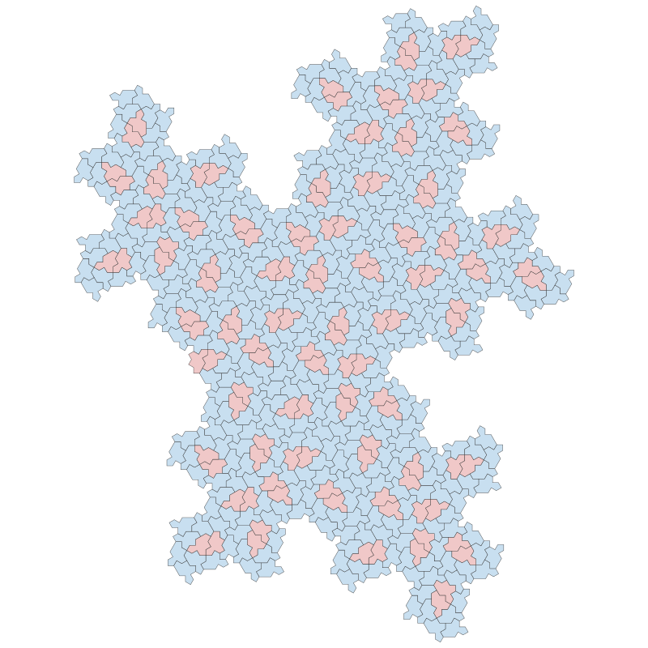
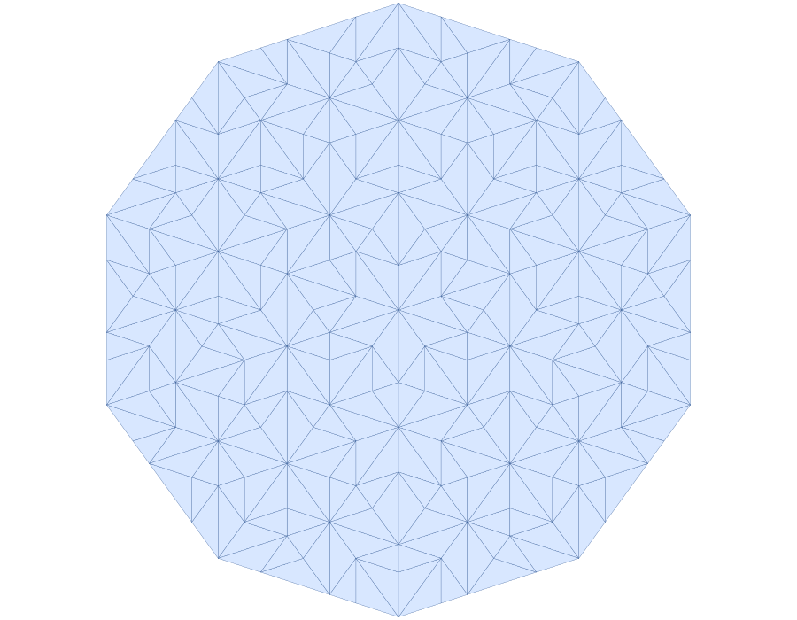

# hat-amp

[](https://github.com/winternewt/hat-amp/actions/workflows/tests.yml)

Python tools for aperiodic tilings and percolation experiments.

`hat-amp` generates exact tile coordinates for the Hat (Tile(1,0)) and Spectre
(Tile(1,1)) aperiodic monotiles via substitution systems ported from Craig Kaplan's
reference implementations, plus Penrose Robinson-triangle patches. It also provides
vertex and tile-dual graph builders, square-window cropping, site/bond percolation
helpers, `.npz` result persistence, and SVG/PNG rendering.

<!-- markdownlint-disable MD033 -->
<p align="center">
  
  
  
</p>
<!-- markdownlint-enable MD033 -->

The **Spectre** is the strictly chiral companion to the Hat — no reflected copy appears
in any valid tiling, making it the first truly chiral aperiodic monotile.  The
**Mystic** is a fused Spectre pair (at 30°) that plays the physics role of an
"anti-hat" and is the minority tile in every Spectre tiling.  Vertex-10 of each
Spectre polygon is the Singh–Flicker *gold vertex*: its inclusion makes the vertex
graph bipartite and enables exact dimer/zero-mode analysis.

---

## Installation

```bash
uv add hat-amp
```

Graph and percolation helpers need SciPy:

```bash
uv add "hat-amp[graph]"
```

PNG export needs CairoSVG:

```bash
uv add "hat-amp[viz]"
```

Requires Python >= 3.13.

## Quick start

**Hat:**

```python
from hat_amp.tiling import generate_tiling

hats = generate_tiling(level=3)   # list of 1156 arrays, each shape (13, 2)
```

For the larger finite-window patch used by percolation workflows:

```python
from hat_amp.tiling import generate_patch_tiling

patch_hats = generate_patch_tiling(level=3)  # 3603 hat polygons
```

**Spectre:**

```python
from hat_amp.spectre import generate_spectre_tiling, generate_spectre_tiling_labeled

# 559 polygons at level 3, each shape (14, 2)
spectres = generate_spectre_tiling(level=3)

# same polygons with per-tile labels: 'S' (standalone) or 'M' (Mystic component)
polygons, labels = generate_spectre_tiling_labeled(level=3)
```

Vertex-10 of each polygon is the Singh–Flicker gold vertex.  Remove it for natural
(non-bipartite) graph analysis:

```python
from hat_amp.spectre import strip_gold_vertex

polys_13v = strip_gold_vertex(spectres)   # each shape (13, 2)
```

Full API documentation: [`docs/API.md`](docs/API.md).

## Example: Graph Crop And Site Percolation

```python
from hat_amp.graph import build_vertex_graph, crop_square
from hat_amp.percolation import BoundarySets, Criterion, run_site_trials
from hat_amp.tiling import generate_patch_tiling

polygons = generate_patch_tiling(level=3)
graph = build_vertex_graph(polygons)
cropped = crop_square(graph, L=100.0)
boundaries = BoundarySets.from_cropped_graph(cropped)

thresholds = run_site_trials(
    cropped,
    boundaries,
    trials=200,
    seed=123,
    criterion=Criterion.INTERSECTION,
)

print(thresholds.mean())
```

## Example: Render SVGs

```python
from hat_amp.penrose import generate_penrose_tiling
from hat_amp.tiling import generate_tiling
from hat_amp.viz import render_patch_svg, render_svg, save_svg

hat_svg = render_svg(generate_tiling(level=2), stroke="#222222", fill="none")
save_svg(hat_svg, "hat_level_2.svg")

penrose = generate_penrose_tiling(divisions=4, scale=200.0)
penrose_svg = render_svg(penrose.polygons(), stroke="#3366aa", fill="none")
save_svg(penrose_svg, "penrose_level_4.svg")

# Spectre: S tiles blue, Mystic tiles red
spectre_svg = render_patch_svg(3, source="spectre")
save_svg(spectre_svg, "spectre_level_3.svg")
```

## Features

- Hat (Tile(1,0)) `H/T/P/F` metatile substitution and full patch generation.
- Spectre (Tile(1,1)) 9-type substitution system (Delta…Psi + Mystic/Gamma compound).
- Per-polygon chirality labels (`'S'` standalone / `'M'` Mystic component).
- Gold-vertex helpers (`strip_gold_vertex` / `add_gold_vertex`) for bipartite graph analysis.
- Penrose Robinson-triangle subdivision.
- Vertex graphs and tile-dual graphs from polygon tilings.
- Square-frame cropping with boundary node sets.
- Site and bond percolation with intersection/union crossing criteria.
- Finite-size weighted least-squares extrapolation for `p_c`.
- `.npz` result persistence with pydantic metadata.
- SVG output and optional PNG export.

---

## Reference

### Tiling sources

- **Kaplan's hatviz** — [`hat.js`](https://raw.githubusercontent.com/isohedral/hatviz/main/hat.js) · [`geometry.js`](https://raw.githubusercontent.com/isohedral/hatviz/main/geometry.js)
  - `geometry.js`: affine transforms as 6-element arrays `[a,b,tx,c,d,ty]`
  - `hat.js`: metatile definitions, 28 substitution rules, recursive inflation
- **Kaplan's Spectre app** — [cs.uwaterloo.ca/~csk/spectre/](https://cs.uwaterloo.ca/~csk/spectre/)
  - 9-type substitution system; tile polygon coordinates and placement geometry
  - `spectre.js`: `buildSupertiles()` transform rules ported to `spectre.py`

### Percolation reference

- **Aperiodic-Monotile-Percolation** —
  [github.com/aaryashBharadwaj/Aperiodic-Monotile-Percolation](https://github.com/aaryashBharadwaj/Aperiodic-Monotile-Percolation)
  — reference percolation workflows and numerical cross-validation in tests.
- Bhola, Biswas, Islam, Damle. *Site percolation on the Hat tiling.*
  Phys. Rev. X **12**, 021058 (2022). [arXiv:2108.12440]
- Bhola, Damle. *Percolation on aperiodic tilings.* arXiv:2311.05634 (2023).

### Primary papers

- Smith, Myers, Kaplan, Goodman-Strauss. *An aperiodic monotile.*
  Combinatorial Theory **4** (2024). [arXiv:2303.10798](https://arxiv.org/abs/2303.10798)
- Smith, Myers, Kaplan, Goodman-Strauss. *A chiral aperiodic monotile.*
  (2023). [arXiv:2305.17743](https://arxiv.org/abs/2305.17743)
- Singh, Flicker. *Exact solution of the dimer model on the spectre tiling.*
  Phys. Rev. B **109**, L220303 (2024). [arXiv:2309.14447](https://arxiv.org/abs/2309.14447)

---

## Acknowledgments

Tiling generation ported from Craig Kaplan's
[hatviz](https://github.com/isohedral/hatviz) (BSD-3-Clause).
